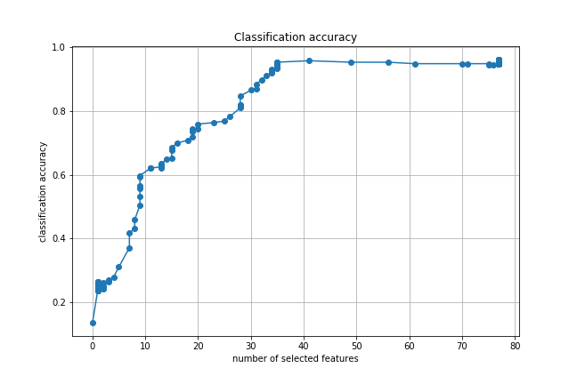

# LassoNet
Demo code for the LassoNet method proposed in "LassoNet: A Neural Network with Feature Sparsity".

## Introduction

Much work has been done recently to make neural networks more interpretable, and one
obvious approach is to arrange for the network to use only a subset of the available features. In linear models, Lasso (or L1-regularized) regression assigns zero weights to the most irrelevant or redundant features, and is widely used in data science. However the Lasso only applies to linear models. Here we introduce LassoNet, a neural network framework with global feature selection. Unlike other approaches to feature selection for neural nets, our method uses a modified objective function with constraints, and so integrates feature selection with the parameter learning directly. As a result, it delivers an entire regularization path of solutions with a range of feature sparsity. LassoNet uses projected proximal gradient descent, and generalizes directly to deep networks.

<!---

*Figure obtained from running LassoNet on the [Mice Protein Expression Data Set] (https://archive.ics.uci.edu/ml/datasets/Mice+Protein+Expression), showing the test accuracy per number of features selected.*
--->

## Demo

### Requirements
- pytorch 1.3.1
- matplotlib 3.1.1

### Execution
First install :
```bash
cd core
pip install .
```
Then run the following python script for a simple demonstration of LassoNet on the Mice Dataset:
```bash
python examples/run_demo_mice.py
```
See core/lassonet/lassonet_trainer.py and core/lassonet/models.py for details.

One png file will be saved in your directory, which is a visualization of the results on the MICE dataset. An interactive version is provided in the notebook ```examples/run_demo_mice.ipynb```. See the paper for details on the Mice dataset. The paper also presents more experiments on real-world datasets.
